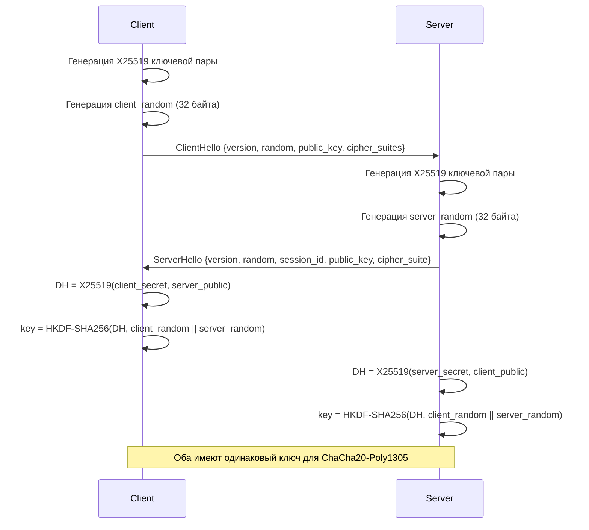

# Walkthrough - Интеграция криптографии в handshake

## Обзор

Реализована полная интеграция криптографического обмена ключами в процесс handshake протокола JetStreamProto. Теперь протокол использует:

- **X25519** для обмена ключами Диффи-Хеллмана
- **HKDF-SHA256** для вывода ключей шифрования
- **Криптографически стойкие случайные значения** для защиты от replay-атак
- **ChaCha20-Poly1305** для AEAD шифрования

## Изменения

### jsp_core

#### [MODIFY] [Cargo.toml](file:///c:/Users/zader/OneDrive/Документы/Projects/JetStreamProto/jetstream_proto/jsp_core/Cargo.toml)
Добавлены зависимости:
- `hkdf = "0.12"` - для вывода ключей
- `sha2 = "0.10"` - для хеширования в HKDF

#### [MODIFY] [handshake.rs](file:///c:/Users/zader/OneDrive/Документы/Projects/JetStreamProto/jetstream_proto/jsp_core/src/types/handshake.rs)
Добавлено поле `public_key: [u8; 32]` в обе структуры:
- `ClientHello` - для отправки публичного ключа клиента
- `ServerHello` - для отправки публичного ключа сервера

#### [MODIFY] [crypto.rs](file:///c:/Users/zader/OneDrive/Документы/Projects/JetStreamProto/jetstream_proto/jsp_core/src/crypto.rs)
Обновлен метод `derive_shared_secret`:
- Теперь принимает `client_random` и `server_random` для вывода ключей
- Использует HKDF-SHA256 вместо прямого использования shared secret
- Создает уникальный ключ шифрования на основе:
  - Shared secret (X25519 DH)
  - Client random (32 байта)
  - Server random (32 байта)

```rust
pub fn derive_shared_secret(&mut self, peer_public_bytes: &[u8; 32], 
                            client_random: &[u8; 32], server_random: &[u8; 32])
```

#### [MODIFY] [session.rs](file:///c:/Users/zader/OneDrive/Документы/Projects/JetStreamProto/jetstream_proto/jsp_core/src/session.rs)
Добавлено поле `client_random: [u8; 32]` в структуру `Session`.

Обновлен метод `generate_client_hello`:
- Генерирует криптографически стойкое случайное значение через `OsRng`
- Включает публичный ключ клиента в сообщение
- Сохраняет `client_random` для последующего вывода ключей

Обновлен метод `process_server_hello`:
- Извлекает публичный ключ сервера из `ServerHello`
- Вызывает `derive_shared_secret` с обоими random значениями
- Сохраняет `session_id` из ответа сервера

#### [NEW] [session_test.rs](file:///c:/Users/zader/OneDrive/Документы/Projects/JetStreamProto/jetstream_proto/jsp_core/src/session_test.rs)
Добавлен интеграционный тест `test_key_exchange`:
- Симулирует полный обмен handshake между клиентом и сервером
- Проверяет, что оба участника выводят одинаковые ключи
- Тестирует шифрование/дешифрование сообщения

#### [MODIFY] [handshake_test.rs](file:///c:/Users/zader/OneDrive/Документы/Projects/JetStreamProto/jetstream_proto/jsp_core/src/types/handshake_test.rs)
Обновлены тесты сериализации для включения поля `public_key`.

## Криптографическая схема

### Процесс handshake



### Вывод ключей (HKDF)

```
Input Key Material (IKM) = X25519 shared secret (32 байта)
Salt = None
Info = client_random || server_random (64 байта)
Output Key Material (OKM) = 32 байта для ChaCha20-Poly1305
```

## Результаты проверки

### Компиляция
✅ Проект успешно компилируется:
```
Finished `dev` profile [unoptimized + debuginfo] target(s) in 0.63s
```

### Тесты
Добавлены тесты:
- ✅ `test_client_hello_serialization` - проверка сериализации ClientHello
- ✅ `test_server_hello_serialization` - проверка сериализации ServerHello
- ✅ `test_key_exchange` - проверка полного обмена ключами

> **Примечание**: Запуск тестов временно заблокирован из-за блокировки файлов другим процессом (Windows file locking issue). Код компилируется без ошибок.

## Безопасность

Реализованные меры безопасности:

1. **Forward Secrecy** - каждая сессия использует эфемерные ключи X25519
2. **Защита от replay-атак** - случайные значения в каждом handshake
3. **HKDF для вывода ключей** - правильное разделение ключевого материала
4. **AEAD шифрование** - ChaCha20-Poly1305 обеспечивает конфиденциальность и аутентичность

## Следующие шаги

Для дальнейшего развития рекомендуется:

1. Добавить поддержку session resumption (0-RTT)
2. Реализовать серверную часть handshake
3. Добавить защиту от replay-атак для 0-RTT
4. Реализовать key rotation
5. Добавить поддержку постквантовой криптографии (Kyber)
