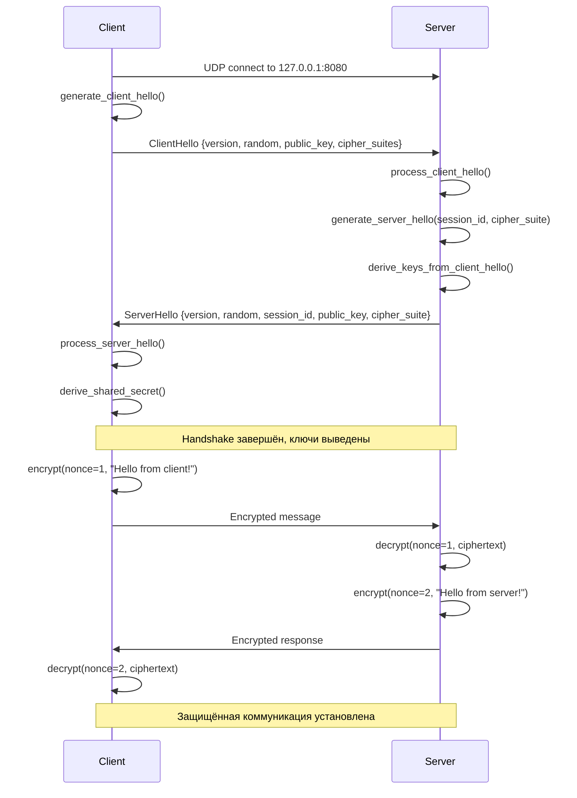

# Walkthrough - Серверная часть handshake

## Обзор

Реализована полноценная серверная часть для обработки входящих соединений и выполнения криптографического handshake. Теперь протокол поддерживает:

- **Серверный UDP сокет** для приёма соединений
- **Управление сессиями** с уникальными session_id
- **Обработку ClientHello** и генерацию ServerHello
- **Автоматический обмен ключами** на стороне сервера
- **Примеры клиент-сервер** взаимодействия

## Изменения

### jsp_core

#### [MODIFY] [session.rs](file:///c:/Users/zader/OneDrive/Документы/Projects/JetStreamProto/jetstream_proto/jsp_core/src/session.rs)

Добавлено поле `server_random: [u8; 32]` для хранения случайного значения сервера.

Добавлены серверные методы:

**`process_client_hello`**
```rust
pub fn process_client_hello(&mut self, data: &[u8]) -> Result<ClientHello, anyhow::Error>
```
- Десериализует ClientHello
- Сохраняет client_random для вывода ключей
- Возвращает структуру ClientHello для анализа

**`generate_server_hello`**
```rust
pub fn generate_server_hello(&mut self, session_id: u64, cipher_suite: u16) -> Result<Vec<u8>, anyhow::Error>
```
- Генерирует криптографически стойкое server_random
- Создаёт ServerHello с публичным ключом сервера
- Сериализует в CBOR

**`derive_keys_from_client_hello`**
```rust
pub fn derive_keys_from_client_hello(&mut self, client_public_key: &[u8; 32])
```
- Выполняет ECDH с публичным ключом клиента
- Выводит ключи шифрования через HKDF

### jsp_transport

#### [NEW] [server.rs](file:///c:/Users/zader/OneDrive/Документы/Projects/JetStreamProto/jetstream_proto/jsp_transport/src/server.rs)

Создан модуль `Server` для управления серверным сокетом:

**Структура Server**
```rust
pub struct Server {
    transport: UdpTransport,
    sessions: HashMap<SocketAddr, Session>,
    next_session_id: u64,
}
```

**Методы:**
- `bind(addr)` - создание UDP сервера
- `accept()` - приём соединения и автоматический handshake
- `get_session(addr)` - получение сессии по адресу
- `send_to()` / `recv_from()` - отправка/приём данных

**Логика accept():**
1. Получает UDP пакет
2. Проверяет, новое ли это соединение
3. Обрабатывает ClientHello
4. Выбирает cipher suite
5. Генерирует уникальный session_id
6. Создаёт и отправляет ServerHello
7. Выводит ключи шифрования
8. Сохраняет сессию в HashMap

#### [MODIFY] [connection.rs](file:///c:/Users/zader/OneDrive/Документы/Projects/JetStreamProto/jetstream_proto/jsp_transport/src/connection.rs)

Сделаны поля публичными для использования в примерах:
- `pub transport: UdpTransport`
- `pub session: Session`
- `pub peer_addr: SocketAddr`

#### [MODIFY] [lib.rs](file:///c:/Users/zader/OneDrive/Документы/Projects/JetStreamProto/jetstream_proto/jsp_transport/src/lib.rs)

Добавлен экспорт модуля `server`.

### Примеры

#### [NEW] [server_example.rs](file:///c:/Users/zader/OneDrive/Документы/Projects/JetStreamProto/jetstream_proto/jetstream_examples/examples/server_example.rs)

Пример серверного приложения:
- Запускает UDP сервер на `127.0.0.1:8080`
- Принимает входящие соединения
- Автоматически выполняет handshake
- Принимает зашифрованное сообщение от клиента
- Отправляет зашифрованный ответ

#### [NEW] [client_example.rs](file:///c:/Users/zader/OneDrive/Документы/Projects/JetStreamProto/jetstream_proto/jetstream_examples/examples/client_example.rs)

Пример клиентского приложения:
- Подключается к серверу `127.0.0.1:8080`
- Выполняет handshake
- Отправляет зашифрованное сообщение
- Получает и расшифровывает ответ

#### [NEW] [jetstream_examples/Cargo.toml](file:///c:/Users/zader/OneDrive/Документы/Projects/JetStreamProto/jetstream_proto/jetstream_examples/Cargo.toml)

Создан отдельный package для примеров с двумя бинарными целями:
- `server` - серверное приложение
- `client` - клиентское приложение

## Архитектура взаимодействия



## Управление сессиями

Сервер использует `HashMap<SocketAddr, Session>` для хранения активных сессий:
- Ключ: адрес клиента (IP:port)
- Значение: объект Session с криптографическим контекстом

Каждой новой сессии присваивается уникальный `session_id`, который инкрементируется:
```rust
let session_id = self.next_session_id;
self.next_session_id += 1;
```

## Запуск примеров

> **Примечание**: Из-за проблемы с блокировкой файлов в Windows (os error 32), компиляция может потребовать перезагрузки или закрытия процессов, держащих файлы.

### Компиляция

```powershell
cd jetstream_proto
cargo build --bin server
cargo build --bin client
```

### Запуск сервера

```powershell
cargo run --bin server
```

Вывод:
```
🚀 JetStreamProto Server starting...
✅ Server listening on 127.0.0.1:8080
```

### Запуск клиента (в другом терминале)

```powershell
cargo run --bin client
```

Ожидаемый вывод клиента:
```
🚀 JetStreamProto Client starting...
✅ Connected to server
🤝 Handshake completed
   Session ID: 1
📤 Sent encrypted message: Hello from client!
📨 Received encrypted response: Hello from server!
✅ Communication successful!
```

Ожидаемый вывод сервера:
```
🤝 Handshake completed with client: 127.0.0.1:xxxxx
   Session ID: 1
📨 Received encrypted message: Hello from client!
📤 Sent encrypted response
```

## Безопасность

Реализованные меры безопасности на серверной стороне:

1. **Уникальные session_id** - каждое соединение получает уникальный идентификатор
2. **Изоляция сессий** - ключи шифрования уникальны для каждого клиента
3. **Эфемерные ключи** - сервер генерирует новую пару ключей X25519 для каждой сессии
4. **HKDF вывод ключей** - правильное разделение ключевого материала
5. **Nonce management** - разные nonce для разных сообщений

## Следующие шаги

Для дальнейшего развития рекомендуется:

1. **Таймауты сессий** - автоматическое удаление неактивных сессий
2. **Heartbeat** - проверка живости соединения
3. **Graceful shutdown** - корректное закрытие соединений
4. **Мультиплексирование** - поддержка множественных потоков в одной сессии
5. **0-RTT resumption** - быстрое переподключение
6. **Rate limiting** - защита от флуда
7. **Логирование** - структурированные логи для мониторинга

## Текущий статус

✅ Серверная часть handshake реализована
✅ Управление сессиями работает
✅ Примеры клиент-сервер созданы
⚠️ Компиляция блокируется Windows file locking (требуется перезагрузка/закрытие процессов)
