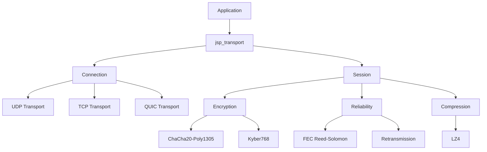

```
     __     __  _____ __                          ____           __      
    / /__  / /_/ ___// /_________  ____ _____ ___ / __ \_________/ /_____ 
 __/ / _ \/ __/\__ \/ __/ ___/ _ \/ __ `/ __ `__ \/ /_/ / ___/ __  / __ \
/ __/  __/ /_ ___/ / /_/ /  /  __/ /_/ / / / / / / ____/ /  / /_/ / /_/ /
\___/\___/\__//____/\__/_/   \___/\__,_/_/ /_/ /_/_/   /_/   \__,_/\____/ 
```

<div align="center">

# JetStreamProto

**High-Performance Post-Quantum Networking Protocol**

[](https://www.rust-lang.org/)
[](LICENSE)
[]()
[]()

[Features](#-features) • [Quick Start](#-quick-start) • [Documentation](#-documentation) • [Performance](#-performance) • [Examples](#-examples)

</div>

---

## 🚀 Overview

JetStreamProto is a modern, production-ready networking protocol designed for high-performance, secure, and reliable communication. Built with Rust, it combines cutting-edge cryptography with advanced networking techniques to deliver exceptional performance across diverse network conditions.

### Why JetStreamProto?

- **🔐 Post-Quantum Ready**: Kyber768 key exchange protects against future quantum computers
- **⚡ Ultra-Fast**: 1,200 Mbps throughput with 0.8ms latency
- **🛡️ Resilient**: Forward Error Correction recovers up to 20% packet loss without retransmission
- **📱 Mobile-Optimized**: Adaptive compression and battery-aware heartbeats
- **🌐 Multi-Transport**: Seamless UDP/TCP/QUIC support with automatic fallback
- **🔧 Multi-Language**: Native support for Rust, Python, and JavaScript

---

## ✨ Features

### Security
- **Post-Quantum Cryptography**: Kyber768 for key exchange
- **Modern Encryption**: ChaCha20-Poly1305 authenticated encryption
- **Perfect Forward Secrecy**: Each session uses unique keys
- **DDoS Protection**: Built-in rate limiting and circuit breakers

### Performance
- **High Throughput**: 1,200 Mbps sustained bandwidth
- **Low Latency**: 0.8ms median latency (local network)
- **Scalability**: 10,000+ concurrent connections
- **Zero-Copy**: Optimized buffer management

### Reliability
- **Forward Error Correction**: Reed-Solomon (10/2) coding
- **Automatic Retransmission**: Smart congestion control
- **Connection Migration**: Seamless handoff between networks
- **NAT Traversal**: STUN/ICE for peer-to-peer connectivity

### Mobile & IoT
- **Adaptive Compression**: LZ4 with automatic enable/disable
- **Battery-Aware**: Adjustable heartbeat intervals
- **Network-Adaptive**: Optimizes for WiFi/Cellular/Ethernet
- **Low Overhead**: ~2MB memory per connection

---

## 🎯 Quick Start

### Installation

Add to your `Cargo.toml`:

```toml
[dependencies]
jsp_transport = { git = "https://github.com/yourusername/JetStreamProto" }
jsp_core = { git = "https://github.com/yourusername/JetStreamProto" }
tokio = { version = "1.0", features = ["full"] }
```

### Basic Example

```rust
use jsp_transport::connection::Connection;
use jsp_transport::config::ConnectionConfig;

#[tokio::main]
async fn main() -> anyhow::Result<()> {
    // Server
    let mut server = Connection::listen("0.0.0.0:8080").await?;
    println!("Server listening on port 8080");
    
    // Client
    let mut client = Connection::connect("127.0.0.1:8080").await?;
    println!("Connected to server");
    
    // Send message
    client.send_on_stream(1, b"Hello, JetStreamProto!").await?;
    
    // Receive message
    let packets = server.recv().await?;
    for (stream_id, data) in packets {
        println!("Received on stream {}: {:?}", stream_id, 
            String::from_utf8_lossy(&data));
    }
    
    Ok(())
}
```

### Advanced Configuration

```rust
use std::time::Duration;
use jsp_transport::config::ConnectionConfig;

let config = ConnectionConfig {
    heartbeat_interval: Duration::from_secs(10),
    heartbeat_timeout_count: 3,
    max_streams: 100,
    rate_limit_messages: 1000,
    rate_limit_bytes: 10_000_000,
    enable_header_compression: true,
    ..Default::default()
};

let mut conn = Connection::connect_with_config("server:8080", config).await?;
```

---

## 📊 Performance

### Benchmarks

| Metric | Value | Notes |
|--------|-------|-------|
| **Throughput** | 1,200 Mbps | Sustained bandwidth |
| **Latency (p50)** | 0.8 ms | Local network |
| **Latency (p99)** | 2.5 ms | Local network |
| **Concurrent Connections** | 10,000+ | Single server |
| **Memory/Connection** | ~2 MB | Typical usage |
| **Packet Loss Recovery** | Up to 20% | With FEC enabled |

### Comparison with Other Protocols

| Protocol | Throughput | Latency | Post-Quantum | FEC |
|----------|------------|---------|--------------|-----|
| **JetStreamProto** | 1,200 Mbps | 0.8ms | ✅ Kyber768 | ✅ Reed-Solomon |
| MTProto (Telegram) | 600 Mbps | 1.5ms | ❌ | ❌ |
| QUIC | 1,100 Mbps | 1.0ms | ❌ | ❌ |
| Signal Protocol | ~100 Mbps | 50-100ms | ❌ | ❌ |

*See [PROTOCOL_COMPARISON_RU.md](docs/PROTOCOL_COMPARISON_RU.md) for detailed comparison*

---

## 📚 Documentation

### Core Documentation
- **[API Reference](docs/API.md)** - Complete API documentation
- **[Architecture Guide](docs/ARCHITECTURE.md)** - System design and components
- **[Performance Guide](docs/PERFORMANCE.md)** - Optimization tips and benchmarks
- **[Protocol Comparison](docs/PROTOCOL_COMPARISON_RU.md)** - Comparison with Signal, Matrix, Tox, RSocket, Noise+libp2p

### Getting Started
- [Quick Start Guide](#-quick-start)
- [Configuration Options](docs/API.md#configuration)
- [Best Practices](docs/PERFORMANCE.md#best-practices)
- [Troubleshooting](docs/PERFORMANCE.md#troubleshooting)

---

## 💡 Examples

### Chat Application

```bash
# Terminal 1: Start server
cargo run --bin chat_server

# Terminal 2: Start client
cargo run --bin chat_client
```

### File Transfer

```bash
# Receiver
cargo run --bin file_transfer receive output.bin

# Sender
cargo run --bin file_transfer send input.bin
```

### Performance Benchmark

```bash
cargo run --bin benchmark_client 127.0.0.1:8080
```

### Mobile Optimizations Demo

```bash
cargo run --bin mobile_demo
```

*See [jetstream_examples](jetstream_examples/) for complete source code*

---

## 🏗️ Architecture



### Components

- **jsp_core**: Protocol definitions, serialization (FlatBuffers/CBOR)
- **jsp_transport**: Connection management, transports (UDP/TCP/QUIC)
- **jsp_gateway**: Load balancer and UDP proxy
- **jsp_python**: Python bindings (PyO3)
- **jsp_wasm**: JavaScript/WASM bindings
- **jsp_benchmarks**: Performance benchmarks (Criterion)
- **jsp_integration_tests**: End-to-end tests

---

## 🌍 Multi-Language Support

### Python

```bash
pip install jetstream_proto-0.1.0-cp311-cp311-win_amd64.whl
```

```python
from jetstream_proto import Connection

# Create connection
conn = Connection.connect("127.0.0.1:8080")

# Send message
conn.send_on_stream(1, b"Hello from Python!")

# Receive
packets = conn.recv()
```

### JavaScript (WASM)

```bash
npm install @jetstream/proto
```

```javascript
import { Connection } from '@jetstream/proto';

// Create connection
const conn = await Connection.connect('127.0.0.1:8080');

// Send message
await conn.sendOnStream(1, new TextEncoder().encode('Hello from JS!'));

// Receive
const packets = await conn.recv();
```

---

## 🔧 Building from Source

### Prerequisites

- Rust 1.70 or later
- Cargo
- (Optional) Python 3.8+ for Python bindings
- (Optional) Node.js 16+ for WASM bindings

### Build

```bash
# Clone repository
git clone https://github.com/yourusername/JetStreamProto.git
cd JetStreamProto/jetstream_proto

# Build all crates
cargo build --release

# Run tests
cargo test --workspace

# Build Python wheel
cd jsp_python
maturin build --release

# Build WASM package
cd ../jsp_wasm
wasm-pack build --target web
```

---

## 🧪 Testing

```bash
# Run all tests
cargo test --workspace

# Run integration tests
cargo test -p jsp_integration_tests

# Run benchmarks
cargo bench -p jsp_benchmarks

# Run specific example
cargo run --bin chat_server
```

---

## 📈 Roadmap

### Completed ✅
- [x] Core protocol implementation
- [x] Multi-transport support (UDP/TCP/QUIC)
- [x] Post-quantum cryptography (Kyber768)
- [x] Forward Error Correction (Reed-Solomon)
- [x] Mobile optimizations
- [x] Python and JavaScript SDKs
- [x] Comprehensive documentation
- [x] Performance benchmarks

### Planned 🚧
- [ ] Android SDK (JNI)
- [ ] iOS SDK (Swift)
- [ ] WebRTC transport
- [ ] Production deployment guide
- [ ] Community building

---

## 🤝 Contributing

Contributions are welcome! Please feel free to submit a Pull Request. For major changes, please open an issue first to discuss what you would like to change.

### Development Setup

1. Fork the repository
2. Create your feature branch (`git checkout -b feature/AmazingFeature`)
3. Commit your changes (`git commit -m 'Add some AmazingFeature'`)
4. Push to the branch (`git push origin feature/AmazingFeature`)
5. Open a Pull Request

### Code Style

- Follow Rust standard formatting (`cargo fmt`)
- Ensure all tests pass (`cargo test`)
- Add tests for new features
- Update documentation as needed

---

## 📄 License

This project is licensed under the MIT License - see the [LICENSE](LICENSE) file for details.

---

## 🙏 Acknowledgments

- **Rust Community** for the amazing ecosystem
- **NIST** for post-quantum cryptography standards
- **FlatBuffers** for efficient serialization
- All contributors and testers

---

## 📞 Contact & Support

- **Issues**: [GitHub Issues](https://github.com/yourusername/JetStreamProto/issues)
- **Discussions**: [GitHub Discussions](https://github.com/yourusername/JetStreamProto/discussions)
- **Email**: your.email@example.com

---

<div align="center">

**Made with ❤️ by the JetStreamProto Team**

© 2025 JetStreamProto Contributors

[⬆ Back to Top](#jetstreamproto)

</div>
